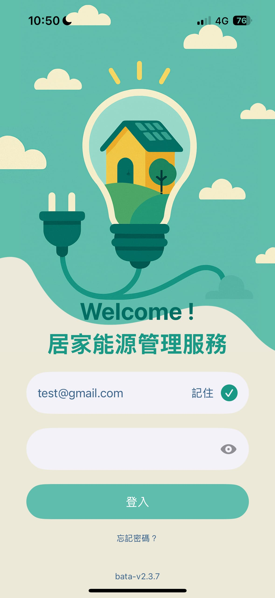
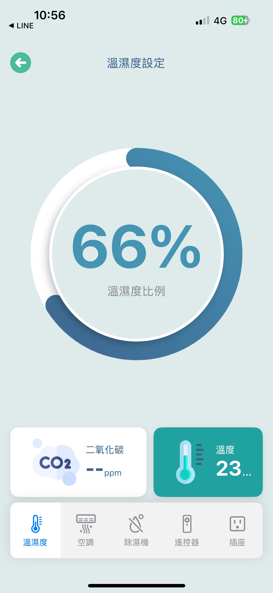
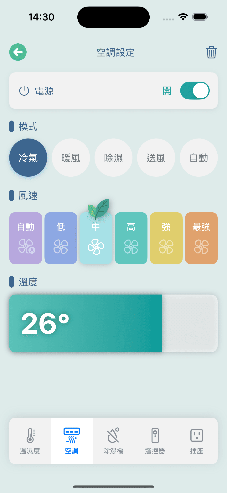
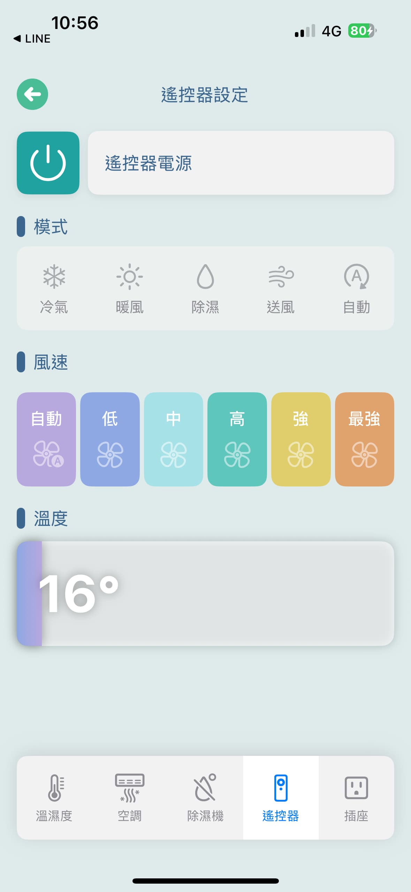

# iii-iOS-IOTController

這是一個基於 SwiftUI 開發的 iOS 應用程式，旨在提供 AIoT 設備的遠端控制功能。透過整合藍牙、紅外線、MQTT 等技術，使用者可以輕鬆地控制多種智慧設備，包括空調、除濕機、插座等。

## 主要功能

- **藍牙裝置連線**
  - 可搜尋並連接支援藍牙的 AIoT 設備。
- **Wi-Fi 設定與搜尋**
  - 設定目標裝置的 Wi-Fi 連線資訊。
  - 搜尋並顯示周圍的 Wi-Fi 熱點。
- **紅外線控制設計**
  - 支援透過紅外線發射器控制傳統家電。
- **五大類設備遠端遙控**：
  - 溫濕度感應器：即時監控與顯示裝置上的環境感測數據。
  - 空調設備：支援多品牌空調操作（紅外線 + MQTT 控制）。
  - 除濕機設備：切換模式、風速、電源等功能。
  - 紅外線遙控器：透過手機紅外線模組控制傳統設備。
  - 插座控制：遠端切換電源狀態。
- **通知功能**
  - 整合 Apple 推播通知（APNs），即時接收設備狀態更新。

## 技術架構與使用套件

- **語言與框架**：
  - Swift 5
  - SwiftUI
- **功能模組與套件**：
  - `CocoaPods`：管理第三方套件依賴。
  - `CocoaMQTT`：實現 MQTT 通訊協議，進行設備控制與資料傳輸。
  - `CoreBluetooth`：實現藍牙連線與資料交換。
  - `SystemConfiguration.CaptiveNetwork`：Wi-Fi 熱點掃描與 SSID 讀取
  - `UserNotifications`：推播通知處理
  - `Reachability`：網路狀態監測
  - `Result API`：處理非同步操作的結果。
  - `QRCodeScanner`：掃描 QR Code，快速配對設備。
  - `Apple Notifications (APNs)`：推播通知，實時獲取設備狀態。

## 快速啟動

```bash
# 1. 下載專案
git clone https://github.com/zhuang8026/iii-iOS-IOTController.git

# 2. 安裝 CocoaPods 套件
cd iii-iOS-IOTController
pod install

# 3. 開啟 Workspace 專案
open Sttptech_energy.xcworkspace
```

## 專案結構

```bash
iii-iOS-IOTController/
├── Sttptech_energy/              # App 主程式
├── Sttptech_energyTests/         # 單元測試
├── Sttptech_energyUITests/       # UI 測試
├── Pods/                         # CocoaPods 依賴套件
└── README.md
```

## 介面截圖

<p align="center">
  
  
  
  
</p>

<!-- ### 登入畫面
 -->
